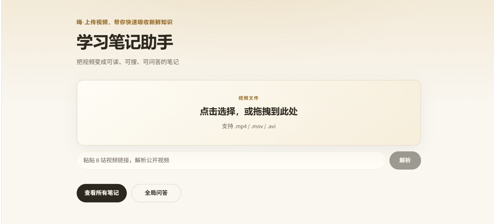
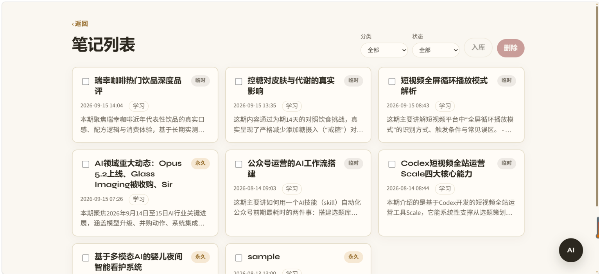
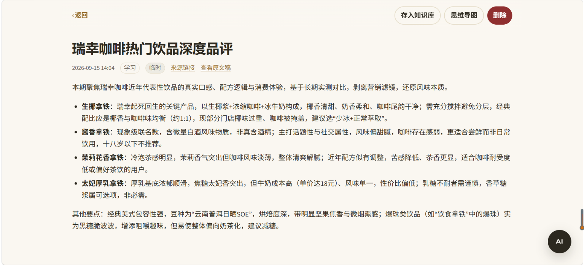
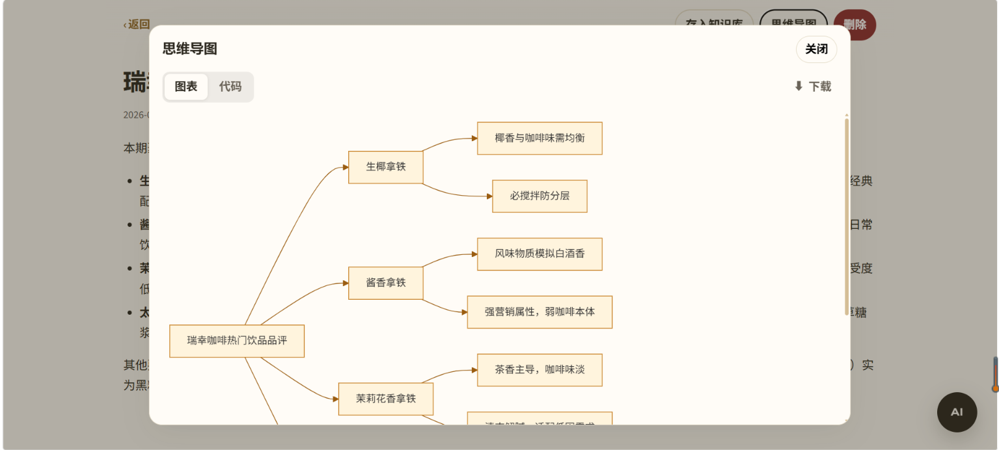
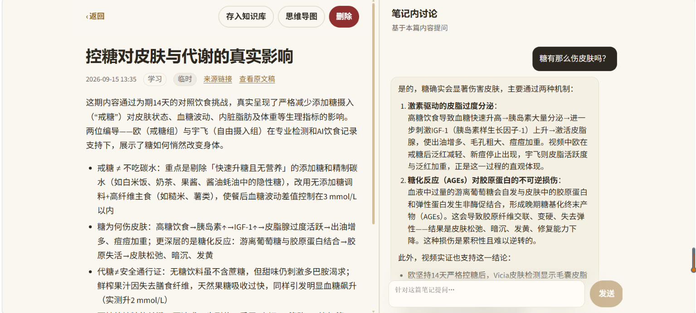
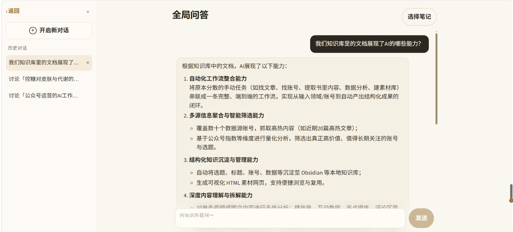

# 多媒体学习资料智能知识库助手

把视频变成可读、可搜、可问答的笔记——上传视频或粘贴 B 站链接，自动生成摘要与思维导图，需要时存入知识库随时提问。

> 仓库：[`kherizyang-hash/multimedia-rag`](https://github.com/kherizyang-hash/multimedia-rag)

---

## 为什么做这个

网上的课程、讲座、B 站视频越来越多，但「看视频」这个动作本身很低效——不能搜索、不能引用、不能快速跳过废话。

这个项目把视频变成**结构化笔记**：上传或粘贴链接，自动转写、总结、生成思维导图；觉得有用就存入知识库，之后可以随时检索提问，每条回答还能定位到视频的哪一分钟。

**差异化**：市面上大多数 RAG 项目只支持 PDF，本项目支持**视频全链路解析**（抽音频 → ASR → 清洗 → 切片入库 → 问答），同时保留文档 RAG 能力。

---

## 核心亮点

| 能力 | 说明 |
|------|------|
| 🎬 **视频 / B站链接 → 结构化笔记** | 不只是转写，而是生成摘要 + Mermaid 思维导图 |
| ⏱️ **时间戳溯源** | 每条回答可定位到视频对应位置 |
| 🚀 **长视频优化** | 40 分钟视频处理从 ~40 分钟降到 ~6 分钟（切段 ASR + faster-whisper + int8） |
| 🧠 **临时 / 永久双模式** | 速读不入库，沉淀才向量化，节省资源 |
| 🔍 **全局知识库问答** | 只检索永久笔记，支持按笔记范围限定，回答附带引用来源 |
| ⚡ **异步任务 + 进度轮询** | 长任务不阻塞 HTTP，前端实时看到「第 3/13 段转写中」 |

**硬约束**：临时笔记不入向量库、不参与全局检索；删除笔记会级联清理向量。

---

## 效果数据

| 场景 | 优化前 | 优化后 |
|------|--------|--------|
| 11 分钟 B 站视频处理 | ~23 分钟 | **~6 分钟** |
| ASR 引擎 | openai-whisper | **faster-whisper + int8** |
| 长视频策略 | 整段转写，无进度 | **180s 切段 + 串行 + 分段进度可见** |
| 临时笔记入库 | 全部入库 | **用户主动触发，默认不入库** |

---

## 技术栈

| 层 | 技术 |
|----|------|
| 前端 | Vue 3 · Vite · Vue Router · Axios · Mermaid · Marked |
| 后端 | Python 3.10 · FastAPI · Uvicorn · BackgroundTasks |
| ASR | faster-whisper（优先）/ openai-whisper（回退）· ffmpeg（imageio-ffmpeg） |
| LLM / Embedding | 通义千问 `qwen-plus` · DashScope `text-embedding-v1` |
| 存储 | PostgreSQL（笔记 + 异步任务）· Zilliz / Milvus（永久笔记向量，HNSW + COSINE） |

---

## 项目架构

```
multimedia-rag/
├── app/                    # 后端业务
│   ├── api/                # HTTP 路由（pipeline / notes / chat / tasks）
│   ├── pipeline/           # 抽音频、切段 ASR、清洗、千问笔记
│   ├── notes/              # 笔记 CRUD + 永久化
│   ├── rag/                # 切片 · 写入 · 向量检索
│   ├── chat/               # 笔记内 / 全局问答
│   ├── tasks/              # 异步处理任务（processing_tasks）
│   ├── embeddings/         # DashScope Embedding
│   ├── db/                 # Postgres / Milvus 连接
│   └── models/             # Pydantic 模型
├── frontend/               # Vue3 前端
│   └── src/views/          # 首页 · 笔记列表 · 预览 · 全局问答
├── tests/                  # pytest
├── data/uploads/           # 运行时上传（不入库）
├── main.py                 # FastAPI 入口
├── requirements.txt
└── .env.example            # 环境变量模板（无真实密钥）
```

**数据流（简图）**

```
视频 / B站链接
    → 异步任务（job_id）
    → 转写 + 清洗 + 千问
    → 临时笔记（Postgres）
    → [可选] permanentize → 切片 Embedding → Zilliz
    → 笔记内讨论 / 全局 RAG 问答
```

---

## 功能截图

### 首页：上传视频 / 粘贴 B站链接



### 笔记列表：卡片式管理，支持分类筛选



### 笔记预览：左侧摘要正文，右侧 AI 讨论



### 思维导图：自动生成，支持看图 / 看代码



### 笔记内讨论：针对当前笔记提问



### 全局知识库问答：限定检索范围，回答带引用来源



---

## 如何启动

### 环境要求

- Python 3.10+
- Node.js 20+（前端）
- 可用的 PostgreSQL、Zilliz Cloud、DashScope API Key

### 1. 配置环境变量

```bash
cp .env.example .env
# 编辑 .env，填入：
#   MILVUS_URI / MILVUS_TOKEN
#   PG_HOST / PG_PORT / PG_USER / PG_PASSWORD / PG_DATABASE
#   DASHSCOPE_API_KEY
```

密钥只放在 `.env`，不要提交到 Git。

### 2. 后端

```bash
python -m venv .venv
source .venv/bin/activate   # Windows: .venv\Scripts\activate
pip install -r requirements.txt

uvicorn main:app --host 0.0.0.0 --port 8080
```

- 健康检查：`http://localhost:8080/health`
- API 文档：`http://localhost:8080/docs`

可选自检：

```bash
python tests/test_connection.py
pytest tests/ -v
```

### 3. 前端

```bash
cd frontend
npm install
npm run dev
```

浏览器打开 `http://localhost:5173`（Vite 将 `/api` 代理到 `8080`）。

---

## 主要 API

| 方法 | 路径 | 说明 |
|------|------|------|
| `GET` | `/health` | 健康检查 |
| `POST` | `/api/pipeline/video` | 上传视频 → 返回 `job_id` |
| `POST` | `/api/pipeline/bilibili` | B 站公开链接 → `job_id` |
| `GET` | `/api/tasks/{job_id}` | 轮询任务进度 |
| `GET` / `DELETE` | `/api/notes` · `/api/notes/{id}` | 笔记列表 / 详情 / 删除 |
| `POST` | `/api/notes/{id}/permanentize` | 存入知识库（切片入库） |
| `POST` | `/api/chat/note` | 笔记内讨论 |
| `POST` | `/api/chat/global` | 全局知识库问答 |

---

## 说明与边界

- **公开 B 站视频**：需登录才能看的内容暂不支持。
- **长视频**：≥3 分钟音频会按约 180s 切段串行 ASR；清洗稿超过约 5000 字时千问走 map-reduce（按 ~3500 字切块串行摘要再合并）。
- **ASR**：优先 faster-whisper（CPU int8）；国内环境建议配置 `HF_ENDPOINT=https://hf-mirror.com`。
- **多用户**：当前为单用户设计，未做鉴权与数据隔离。

---

## 后续规划

- 项目还有诸多待完善之处。

---

## License

个人学习。第三方 API（通义、Zilliz、B 站）请遵守各自服务条款。